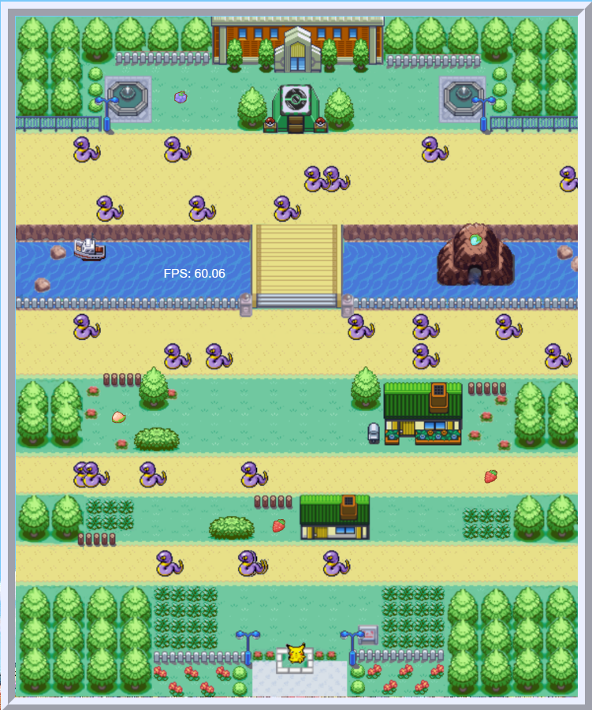

---

---

[Let's Play!](https://luiscaboc.github.io/luiscabocastro-PokemonRush/)

[Build Status] (processing)

[](https://forthebadge.com)


[](https://forthebadge.com) [![forthebadge](data:image/svg+xml;base64,PHN2ZyB4bWxucz0iaHR0cDovL3d3dy53My5vcmcvMjAwMC9zdmciIHdpZHRoPSIyMDguODYiIGhlaWdodD0iMzUiIHZpZXdCb3g9IjAgMCAyMDguODYgMzUiPjxyZWN0IGNsYXNzPSJzdmdfX3JlY3QiIHg9IjAiIHk9IjAiIHdpZHRoPSIxMDYuMjQiIGhlaWdodD0iMzUiIGZpbGw9IiMzMUM0RjMiLz48cmVjdCBjbGFzcz0ic3ZnX19yZWN0IiB4PSIxMDQuMjQiIHk9IjAiIHdpZHRoPSIxMDQuNjIiIGhlaWdodD0iMzUiIGZpbGw9IiMzODlBRDUiLz48cGF0aCBjbGFzcz0ic3ZnX190ZXh0IiBkPSJNMTMuOTUgMTguMTlMMTMuOTUgMTguMTlMMTMuOTUgMTcuMzlRMTMuOTUgMTYuMTkgMTQuMzggMTUuMjdRMTQuODAgMTQuMzUgMTUuNjAgMTMuODVRMTYuNDAgMTMuMzUgMTcuNDUgMTMuMzVMMTcuNDUgMTMuMzVRMTguODYgMTMuMzUgMTkuNzMgMTQuMTJRMjAuNTkgMTQuODkgMjAuNzMgMTYuMjlMMjAuNzMgMTYuMjlMMTkuMjUgMTYuMjlRMTkuMTQgMTUuMzcgMTguNzEgMTQuOTZRMTguMjggMTQuNTUgMTcuNDUgMTQuNTVMMTcuNDUgMTQuNTVRMTYuNDggMTQuNTUgMTUuOTcgMTUuMjZRMTUuNDUgMTUuOTYgMTUuNDQgMTcuMzNMMTUuNDQgMTcuMzNMMTUuNDQgMTguMDlRMTUuNDQgMTkuNDcgMTUuOTMgMjAuMjBRMTYuNDMgMjAuOTIgMTcuMzggMjAuOTJMMTcuMzggMjAuOTJRMTguMjUgMjAuOTIgMTguNjkgMjAuNTNRMTkuMTMgMjAuMTQgMTkuMjUgMTkuMjJMMTkuMjUgMTkuMjJMMjAuNzMgMTkuMjJRMjAuNjAgMjAuNTkgMTkuNzIgMjEuMzVRMTguODQgMjIuMTIgMTcuMzggMjIuMTJMMTcuMzggMjIuMTJRMTYuMzYgMjIuMTIgMTUuNTkgMjEuNjNRMTQuODEgMjEuMTUgMTQuMzkgMjAuMjZRMTMuOTcgMTkuMzcgMTMuOTUgMTguMTlaTTI0Ljc3IDE4LjAwTDI0Ljc3IDE4LjAwTDI0Ljc3IDE3LjUyUTI0Ljc3IDE2LjI4IDI1LjIxIDE1LjMyUTI1LjY1IDE0LjM3IDI2LjQ2IDEzLjg2UTI3LjI3IDEzLjM1IDI4LjMxIDEzLjM1UTI5LjM1IDEzLjM1IDMwLjE2IDEzLjg1UTMwLjk2IDE0LjM1IDMxLjQwIDE1LjI5UTMxLjg0IDE2LjIzIDMxLjg1IDE3LjQ4TDMxLjg1IDE3LjQ4TDMxLjg1IDE3Ljk2UTMxLjg1IDE5LjIxIDMxLjQxIDIwLjE2UTMwLjk4IDIxLjEwIDMwLjE4IDIxLjYxUTI5LjM3IDIyLjEyIDI4LjMyIDIyLjEyTDI4LjMyIDIyLjEyUTI3LjI4IDIyLjEyIDI2LjQ3IDIxLjYxUTI1LjY2IDIxLjEwIDI1LjIyIDIwLjE3UTI0Ljc4IDE5LjIzIDI0Ljc3IDE4LjAwWk0yNi4yNSAxNy40NkwyNi4yNSAxNy45NlEyNi4yNSAxOS4zNiAyNi44MCAyMC4xM1EyNy4zNSAyMC45MCAyOC4zMiAyMC45MEwyOC4zMiAyMC45MFEyOS4zMSAyMC45MCAyOS44NCAyMC4xNVEzMC4zNyAxOS40MCAzMC4zNyAxNy45NkwzMC4zNyAxNy45NkwzMC4zNyAxNy41MVEzMC4zNyAxNi4wOSAyOS44MyAxNS4zNFEyOS4yOSAxNC41OCAyOC4zMSAxNC41OEwyOC4zMSAxNC41OFEyNy4zNSAxNC41OCAyNi44MSAxNS4zM1EyNi4yNiAxNi4wOSAyNi4yNSAxNy40NkwyNi4yNSAxNy40NlpNMzcuODAgMjJMMzYuMzEgMjJMMzYuMzEgMTMuNDdMMzcuODAgMTMuNDdMNDEuNjEgMTkuNTRMNDEuNjEgMTMuNDdMNDMuMDggMTMuNDdMNDMuMDggMjJMNDEuNjAgMjJMMzcuODAgMTUuOTVMMzcuODAgMjJaTTQ5LjUwIDE0LjY2TDQ2Ljg3IDE0LjY2TDQ2Ljg3IDEzLjQ3TDUzLjYzIDEzLjQ3TDUzLjYzIDE0LjY2TDUwLjk3IDE0LjY2TDUwLjk3IDIyTDQ5LjUwIDIyTDQ5LjUwIDE0LjY2Wk01OC4xNyAyMkw1Ni42MyAyMkw1OS44NSAxMy40N0w2MS4xOCAxMy40N0w2NC40MSAyMkw2Mi44NiAyMkw2Mi4xNiAyMC4wMUw1OC44NiAyMC4wMUw1OC4xNyAyMlpNNjAuNTEgMTUuMjhMNTkuMjggMTguODJMNjEuNzUgMTguODJMNjAuNTEgMTUuMjhaTTY5LjkzIDIyTDY4LjQ1IDIyTDY4LjQ1IDEzLjQ3TDY5LjkzIDEzLjQ3TDY5LjkzIDIyWk03Ni4yMiAyMkw3NC43NCAyMkw3NC43NCAxMy40N0w3Ni4yMiAxMy40N0w4MC4wNCAxOS41NEw4MC4wNCAxMy40N0w4MS41MSAxMy40N0w4MS41MSAyMkw4MC4wMiAyMkw3Ni4yMiAxNS45NUw3Ni4yMiAyMlpNODUuODEgMTkuNDJMODUuODEgMTkuNDJMODcuMzAgMTkuNDJRODcuMzAgMjAuMTUgODcuNzggMjAuNTVRODguMjYgMjAuOTUgODkuMTUgMjAuOTVMODkuMTUgMjAuOTVRODkuOTMgMjAuOTUgOTAuMzIgMjAuNjNROTAuNzEgMjAuMzIgOTAuNzEgMTkuODBMOTAuNzEgMTkuODBROTAuNzEgMTkuMjQgOTAuMzEgMTguOTRRODkuOTEgMTguNjMgODguODggMTguMzJRODcuODUgMTguMDEgODcuMjQgMTcuNjNMODcuMjQgMTcuNjNRODYuMDggMTYuOTAgODYuMDggMTUuNzJMODYuMDggMTUuNzJRODYuMDggMTQuNjkgODYuOTIgMTQuMDJRODcuNzYgMTMuMzUgODkuMTAgMTMuMzVMODkuMTAgMTMuMzVRODkuOTkgMTMuMzUgOTAuNjkgMTMuNjhROTEuMzkgMTQuMDEgOTEuNzggMTQuNjFROTIuMTggMTUuMjIgOTIuMTggMTUuOTZMOTIuMTggMTUuOTZMOTAuNzEgMTUuOTZROTAuNzEgMTUuMjkgOTAuMjkgMTQuOTFRODkuODcgMTQuNTQgODkuMDkgMTQuNTRMODkuMDkgMTQuNTRRODguMzYgMTQuNTQgODcuOTYgMTQuODVRODcuNTYgMTUuMTYgODcuNTYgMTUuNzFMODcuNTYgMTUuNzFRODcuNTYgMTYuMTggODcuOTkgMTYuNTBRODguNDMgMTYuODEgODkuNDIgMTcuMTBROTAuNDIgMTcuNDAgOTEuMDIgMTcuNzhROTEuNjMgMTguMTYgOTEuOTEgMTguNjVROTIuMTkgMTkuMTMgOTIuMTkgMTkuNzlMOTIuMTkgMTkuNzlROTIuMTkgMjAuODYgOTEuMzcgMjEuNDlROTAuNTUgMjIuMTIgODkuMTUgMjIuMTJMODkuMTUgMjIuMTJRODguMjMgMjIuMTIgODcuNDUgMjEuNzdRODYuNjcgMjEuNDMgODYuMjQgMjAuODNRODUuODEgMjAuMjIgODUuODEgMTkuNDJaIiBmaWxsPSIjRkZGRkZGIi8+PHBhdGggY2xhc3M9InN2Z19fdGV4dCIgZD0iTTEyMC44MSAyMkwxMTguNDMgMjJMMTE4LjQzIDEzLjYwTDEyMi4yNyAxMy42MFExMjMuNDEgMTMuNjAgMTI0LjI1IDEzLjk4UTEyNS4wOSAxNC4zNSAxMjUuNTUgMTUuMDZRMTI2LjAwIDE1Ljc2IDEyNi4wMCAxNi43MUwxMjYuMDAgMTYuNzFRMTI2LjAwIDE3LjY2IDEyNS41NSAxOC4zNVExMjUuMDkgMTkuMDUgMTI0LjI1IDE5LjQyUTEyMy40MSAxOS44MCAxMjIuMjcgMTkuODBMMTIyLjI3IDE5LjgwTDEyMC44MSAxOS44MEwxMjAuODEgMjJaTTEyMC44MSAxNS40N0wxMjAuODEgMTcuOTNMMTIyLjEzIDE3LjkzUTEyMi44NiAxNy45MyAxMjMuMjMgMTcuNjFRMTIzLjYwIDE3LjI5IDEyMy42MCAxNi43MUwxMjMuNjAgMTYuNzFRMTIzLjYwIDE2LjEyIDEyMy4yMyAxNS44MFExMjIuODYgMTUuNDcgMTIyLjEzIDE1LjQ3TDEyMi4xMyAxNS40N0wxMjAuODEgMTUuNDdaTTEzMy4xMyAyMkwxMzAuNzYgMjJMMTMwLjc2IDEzLjYwTDEzMy4xMyAxMy42MEwxMzMuMTMgMjJaTTE0MC42NiAyMkwxMzguMzEgMjJMMTM4LjMxIDEzLjYwTDE0MC42NiAxMy42MEwxNDAuNjYgMTcuMDlMMTQzLjkyIDEzLjYwTDE0Ni41MyAxMy42MEwxNDMuMTAgMTcuMzJMMTQ2LjcxIDIyTDE0My45NSAyMkwxNDEuNTUgMTguOTVMMTQwLjY2IDE5LjkwTDE0MC42NiAyMlpNMTUyLjI0IDIyTDE0OS44MSAyMkwxNTMuNTIgMTMuNjBMMTU1Ljg2IDEzLjYwTDE1OS41OCAyMkwxNTcuMTEgMjJMMTU2LjQ1IDIwLjM3TDE1Mi45MCAyMC4zN0wxNTIuMjQgMjJaTTE1NC42NyAxNS45M0wxNTMuNTkgMTguNjFMMTU1Ljc1IDE4LjYxTDE1NC42NyAxNS45M1pNMTYzLjMwIDE3LjgwTDE2My4zMCAxNy44MFExNjMuMzAgMTYuNTQgMTYzLjkwIDE1LjU0UTE2NC41MCAxNC41NSAxNjUuNTUgMTMuOTlRMTY2LjYwIDEzLjQzIDE2Ny45MiAxMy40M0wxNjcuOTIgMTMuNDNRMTY5LjA4IDEzLjQzIDE3MC4wMCAxMy44NFExNzAuOTIgMTQuMjUgMTcxLjU0IDE1LjAyTDE3MS41NCAxNS4wMkwxNzAuMDMgMTYuMzlRMTY5LjIxIDE1LjQwIDE2OC4wNSAxNS40MEwxNjguMDUgMTUuNDBRMTY3LjM2IDE1LjQwIDE2Ni44MyAxNS43MFExNjYuMjkgMTYgMTY2LjAwIDE2LjU0UTE2NS43MCAxNy4wOSAxNjUuNzAgMTcuODBMMTY1LjcwIDE3LjgwUTE2NS43MCAxOC41MSAxNjYuMDAgMTkuMDVRMTY2LjI5IDE5LjYwIDE2Ni44MyAxOS45MFExNjcuMzYgMjAuMjAgMTY4LjA1IDIwLjIwTDE2OC4wNSAyMC4yMFExNjkuMjEgMjAuMjAgMTcwLjAzIDE5LjIyTDE3MC4wMyAxOS4yMkwxNzEuNTQgMjAuNThRMTcwLjkzIDIxLjM1IDE3MC4wMCAyMS43NlExNjkuMDggMjIuMTcgMTY3LjkyIDIyLjE3TDE2Ny45MiAyMi4xN1ExNjYuNjAgMjIuMTcgMTY1LjU1IDIxLjYxUTE2NC41MCAyMS4wNSAxNjMuOTAgMjAuMDVRMTYzLjMwIDE5LjA2IDE2My4zMCAxNy44MFpNMTc4LjQ1IDIyTDE3Ni4wNyAyMkwxNzYuMDcgMTMuNjBMMTc4LjQ1IDEzLjYwTDE3OC40NSAxNi43NkwxODEuNjkgMTYuNzZMMTgxLjY5IDEzLjYwTDE4NC4wNiAxMy42MEwxODQuMDYgMjJMMTgxLjY5IDIyTDE4MS42OSAxOC43MkwxNzguNDUgMTguNzJMMTc4LjQ1IDIyWk0xODkuMTYgMTguMjZMMTg5LjE2IDE4LjI2TDE4OS4xNiAxMy42MEwxOTEuNTQgMTMuNjBMMTkxLjU0IDE4LjE5UTE5MS41NCAyMC4yMCAxOTMuMTMgMjAuMjBMMTkzLjEzIDIwLjIwUTE5NC43MSAyMC4yMCAxOTQuNzEgMTguMTlMMTk0LjcxIDE4LjE5TDE5NC43MSAxMy42MEwxOTcuMDUgMTMuNjBMMTk3LjA1IDE4LjI2UTE5Ny4wNSAyMC4xMyAxOTYuMDEgMjEuMTVRMTk0Ljk3IDIyLjE3IDE5My4xMSAyMi4xN0wxOTMuMTEgMjIuMTdRMTkxLjIzIDIyLjE3IDE5MC4xOSAyMS4xNVExODkuMTYgMjAuMTMgMTg5LjE2IDE4LjI2WiIgZmlsbD0iI0ZGRkZGRiIgeD0iMTE3LjI0Ii8+PC9zdmc+)](https://forthebadge.com)





desarrollado en HTML Canvas Graphics Juego
entorno de Node.js

## Tabla de contenidos / (indice)

1. Descripción del juego
    1. Objetivo del juego
    2. Información del juego
    3. Instrucciones
2. Proyecto y motivación
3. Estructura del proyecto
4. Tecnologías empleadas
5. Manual de instalación y deployment
    1. Instalación
    2. Deploy
6. Entornos de ejecución
7. Variables globales
8. Listado de paquetes y dependencias
    1. Paquetes
    2. Dependencias
9. Estadísticas
10. Agradecimientos
11. Licencias

```
├───📁 docs/
├───📁 public/
│   └───📄 style.css
├───📁 src/
│   ├───📁 actors/
│   │   ├───📄 Actor.ts
│   │   ├───📄 Background.ts
│   │   ├───📄 Bayas.ts
│   │   ├───📄 Ekans.ts
│   │   ├───📄 FPSViewer.ts
│   │   ├───📄 ObstaculoBaya.ts
│   │   └───📄 Pikachu.ts
│   ├───📁 assets/
│   │   ├───📁 bayas/
│   │   ├───📄 ekansSprites.png
│   │   ├───📄 fondoPokemon.png
│   │   ├───📄 mapadefinitivo.png
│   │   ├───📄 MapaJuegoPokemon.png
│   │   ├───📄 pikasprites.png
│   │   ├───📄 pokemon-opening.mp3
│   │   └───📄 PokemonTitle.png
│   ├───📁 types/
│   │   └───📄 Point.ts
│   ├───📁 utils/
│   │   ├───📄 angleToRad.ts
│   │   ├───📄 checkLimits.ts
│   │   └───📄 KeyboardMap.ts
│   └───📄 script.ts
├───📄 .gitignore
├───📄 index.d.ts
├───📄 index.html
├───📄 package-lock.json
├───📄 package.json
├───📄 README.md
├───📄 tsconfig.json
└───📄 tsconfig.tsbuildinfo


```


## Descripción del objetivo del juego

> 

Primer proyecto de juego en 2D realizado en CORE Code School. El juego está basado en el mundo Pokemon, con un estilo retro al más puro estilo de  la GameBoy Advance, para los más nostalgicos.

## Objetivo del juego:

> 

LLeva a Pikachu y muevete a través de un arduo camino lleno de peligros, esquivando obstaculos y cualquier contacto con los ekans hasta llegar al podium de la victoria, pero antes tendrás que recoger las bayas que están desperdigadas por el mapa, ¡Hazte con todas!.
 
## Información del juego:

> 

- Mapa
> 

El mapa está formado por una serie de 7 caminos infestado de Ekans. Los caminos se iran uniendo a medida que avanza en el mapa y se acerca el final.
El mapa está delimitado por vallas, árboles y casas, entre otros.
Al llegar al último camino después de cruzar el puente y con todas las bayas llevadas contigo, tendrás que subirte en el podio de la victoria para ganar el juego.


- Bayas
> 
Las bayas pueden aparecer en tu camino, no las ignores. Recoge tantas como haya en el mapa y consigue todas las que se muestren en el marcador. Una vez conseguidas todas las bayas, tendrás que subirte en el podio de la victoria y así poder ganar el juego.

- Pikachu
> 
No dejes que los ekans te muerdan. Mantén todas tus bayas a salvo de los ekans sin que te toquen, sino volverás a la posición inicial donde empezaste y tendrás que volver a recolectar todas las bayas.
30 triplica los puntos que ganas.


- Ekans
> 

Alejate de estos pokemons ya que toparte con ellos será tu perdición. Estos ekans estarán distribuidos en grupo por cada uno de los caminos del mapa para impedirte que ganes el juego. Una vez te toque un ekans tendrás que volver a empezar desde tu posición inicial. Si llevas bayas contigo... ¡Mala suerte!, volverás sin ninguna de tus bayas.


### Instrucciones
> 

| Movimiento     | Pikachu |
| ---      | ---    |
| Subir | ⬆️    |
| Derecha | ➡️|    |
| Bajar | ⬇️      |
| Izquierda | ⬅️|   |


## Tecnologias empleadas

- Lenguajes y herramientas utilizados:


| Vite    |
| Javascript |
| Typescript |
| HTML |
| CSS |


First line with two spaces after.  
And the next line.

First line with the HTML tag after.<br>
And the next line.

## Proyecto y Motivación

Este proyecto nace inspirado en el universo Pokemon mezclado con un juego clásico al que todos hemos jugado alguna vez como el Frogger. El proyecto como parte de mi formación, no sólo ha supuesto un reto para mí, sino que siempre quise probar la experiencia de crear un juego en 2D. Realizar este juego ha sido un desafío hacia todo lo que sé en programación y a veces a llegado a ser frustrante. Empezar es dificil pero una vez vas avanzando y ves que va cogiendo forma y funcionando. El proyecto está en proceso de completar las últimas funcionalidades ya que para todo lo que tenía en mente 2 semanas es un tiempo muy reducido para alguien que crea un juego con typescript por primera vez. Pero orgulloso de conseguir lo que tengo hasta el momento.
>
La motivación que me lleva a desarrollar este juego, es que fue uno de los juegos arcades a los que mas hora dediqué de pequeño.


## Estructura del juego


### Uso de sprites para la representación del juego:

- Sprites de actores principales:

|  Pikachu     |  Ekans |
| ---      | ---    |
|  |     |


### Mapa

Para el mapa he usado Photoshop para poder crear un mapa único y original


El proyecto está dividido en:

- Actores

Structure
The project is divided into:

Client: It contains the implementation of dynamic dashboards using libraries such as Streamlit, Plotly, etc.

Server: Api that is consumed to obtain the necessary resources to supply the client. Api that is consumed to obtain the necessary resources to supply the customer. The Api is implemented using the FastApi python framework

Data: This directory contains the csv file with the statistics for each Euro 2020 match and a Jupyter Notebook in which the data is processed and cleaned and then stored in a database.


## Manual de instalación y deployment

### Instalación

Para descargarnos el juego, instalarlo, debemos ejecutar los siguientes comandos.

- Clonamos el repositorio

```
git clone git@github.com:luiscaboc/luiscabocastro-PokemonRush.git / https://github.com/luiscaboc/luiscabocastro-PokemonRush

```

> git clone git@github.com:luiscaboc/luiscabocastro-PokemonRush.git / https://github.com/luiscaboc/luiscabocastro-PokemonRush

- Nos situamos en la carpeta 

> 

- Instalamos las dependencias

> npm install

### Ejecución

- Comando para ejecutar el juego en modo desarrollo

> npm run dev

- Comando para ejecutar el juego en modo producción

> npm run start

### Building

- Comando para compilar el juego

> npm run build


## Ejemplos de código

-- Actores:
- Baya 
- Pikachu
- Ekans

-- Background:

-- Script

## entornos de ejecución

## variables globales

To run this project, you will need to add the following environment variables to your .env file

FOOTBALL_DATA_API_TOKEN

MONGODB_URL

To add some interesting data, requests are made to the following api football-data, you can get an api token for free

You can add a connection url to Mongodb (on-premises or in the cloud)

## Listado de paquetes y dependencias

## Estadísticas

## Licencias

https://choosealicense.com/licenses/mit/

## Agradecimientos


Quedará registrado un evento durante el flujo normal del juego en el momento en que dos o más actores colisionen

Set-up
Emplearemos parcel como el paquete de npm que nos permitirá ejecutar el front
Instalar npm o yarn como gestores de paquetes
README.md


> ## The quarterly results look great!
>
> - Revenue was off the chart.
> - Profits were higher than ever.
>
>  *Everything* is going according to **plan**.


 ## Unordered Lists
- First item
- Second item
- Third item
    - Indented item
    - Indented item
- Fourth item


## Code Blocks
 
1. Open the file.
2. Find the following code block on line 21:

        <html>
          <head>
            <title>Test</title>
          </head>

3. Update the title to match the name of your website.


## horizontal rule best practices

Try to put a blank line before...

---

...and after a horizontal rule.

***

---

## links

My favorite search engine is [Duck Duck Go](https://duckduckgo.com).


## urls and email addresses
<https://www.markdownguide.org>
<fake@example.com>


## tablas

| Syntax      | Description |
| ----------- | ----------- |
| Header      | Title       |
| Paragraph   | Text        |


## alignment

| Syntax      | Description | Test Text     |
| :---        |    :----:   |          ---: |
| Header      | Title       | Here's this   |
| Paragraph   | Text        | And more      |


## Syntax highighting 

```json
{
  "firstName": "John",
  "lastName": "Smith",
  "age": 25
}
```
## strikethrough

~~The world is flat.~~ We now know that the world is round.

## task lists

- [x] Write the press release
- [ ] Update the website
- [ ] Contact the media


# Highlight


I need to highlight these ==very important words==.

NO FUNCIONA EL SUBRAYADO

## Admonitions

> :warning: **Warning:** Do not push the big red button.

> :memo: **Note:** Sunrises are beautiful.

> :bulb: **Tip:** Remember to appreciate the little things in life.


| Syntax      | Description |
| ----------- | ----------- |
| Header      | Title |
| List        | Here's a list! <ul><li>Item one.</li><li>Item two.</li></ul> |

#### Table of Contents

- [Underline](#underline)
- [Indent](#indent)
- [Center](#center)
- [Color](#color)
