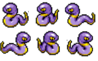

[](https://forthebadge.com)

[](https://forthebadge.com)    [![forthebadge](data:image/svg+xml;base64,PHN2ZyB4bWxucz0iaHR0cDovL3d3dy53My5vcmcvMjAwMC9zdmciIHdpZHRoPSIyMDguODYiIGhlaWdodD0iMzUiIHZpZXdCb3g9IjAgMCAyMDguODYgMzUiPjxyZWN0IGNsYXNzPSJzdmdfX3JlY3QiIHg9IjAiIHk9IjAiIHdpZHRoPSIxMDYuMjQiIGhlaWdodD0iMzUiIGZpbGw9IiMzMUM0RjMiLz48cmVjdCBjbGFzcz0ic3ZnX19yZWN0IiB4PSIxMDQuMjQiIHk9IjAiIHdpZHRoPSIxMDQuNjIiIGhlaWdodD0iMzUiIGZpbGw9IiMzODlBRDUiLz48cGF0aCBjbGFzcz0ic3ZnX190ZXh0IiBkPSJNMTMuOTUgMTguMTlMMTMuOTUgMTguMTlMMTMuOTUgMTcuMzlRMTMuOTUgMTYuMTkgMTQuMzggMTUuMjdRMTQuODAgMTQuMzUgMTUuNjAgMTMuODVRMTYuNDAgMTMuMzUgMTcuNDUgMTMuMzVMMTcuNDUgMTMuMzVRMTguODYgMTMuMzUgMTkuNzMgMTQuMTJRMjAuNTkgMTQuODkgMjAuNzMgMTYuMjlMMjAuNzMgMTYuMjlMMTkuMjUgMTYuMjlRMTkuMTQgMTUuMzcgMTguNzEgMTQuOTZRMTguMjggMTQuNTUgMTcuNDUgMTQuNTVMMTcuNDUgMTQuNTVRMTYuNDggMTQuNTUgMTUuOTcgMTUuMjZRMTUuNDUgMTUuOTYgMTUuNDQgMTcuMzNMMTUuNDQgMTcuMzNMMTUuNDQgMTguMDlRMTUuNDQgMTkuNDcgMTUuOTMgMjAuMjBRMTYuNDMgMjAuOTIgMTcuMzggMjAuOTJMMTcuMzggMjAuOTJRMTguMjUgMjAuOTIgMTguNjkgMjAuNTNRMTkuMTMgMjAuMTQgMTkuMjUgMTkuMjJMMTkuMjUgMTkuMjJMMjAuNzMgMTkuMjJRMjAuNjAgMjAuNTkgMTkuNzIgMjEuMzVRMTguODQgMjIuMTIgMTcuMzggMjIuMTJMMTcuMzggMjIuMTJRMTYuMzYgMjIuMTIgMTUuNTkgMjEuNjNRMTQuODEgMjEuMTUgMTQuMzkgMjAuMjZRMTMuOTcgMTkuMzcgMTMuOTUgMTguMTlaTTI0Ljc3IDE4LjAwTDI0Ljc3IDE4LjAwTDI0Ljc3IDE3LjUyUTI0Ljc3IDE2LjI4IDI1LjIxIDE1LjMyUTI1LjY1IDE0LjM3IDI2LjQ2IDEzLjg2UTI3LjI3IDEzLjM1IDI4LjMxIDEzLjM1UTI5LjM1IDEzLjM1IDMwLjE2IDEzLjg1UTMwLjk2IDE0LjM1IDMxLjQwIDE1LjI5UTMxLjg0IDE2LjIzIDMxLjg1IDE3LjQ4TDMxLjg1IDE3LjQ4TDMxLjg1IDE3Ljk2UTMxLjg1IDE5LjIxIDMxLjQxIDIwLjE2UTMwLjk4IDIxLjEwIDMwLjE4IDIxLjYxUTI5LjM3IDIyLjEyIDI4LjMyIDIyLjEyTDI4LjMyIDIyLjEyUTI3LjI4IDIyLjEyIDI2LjQ3IDIxLjYxUTI1LjY2IDIxLjEwIDI1LjIyIDIwLjE3UTI0Ljc4IDE5LjIzIDI0Ljc3IDE4LjAwWk0yNi4yNSAxNy40NkwyNi4yNSAxNy45NlEyNi4yNSAxOS4zNiAyNi44MCAyMC4xM1EyNy4zNSAyMC45MCAyOC4zMiAyMC45MEwyOC4zMiAyMC45MFEyOS4zMSAyMC45MCAyOS44NCAyMC4xNVEzMC4zNyAxOS40MCAzMC4zNyAxNy45NkwzMC4zNyAxNy45NkwzMC4zNyAxNy41MVEzMC4zNyAxNi4wOSAyOS44MyAxNS4zNFEyOS4yOSAxNC41OCAyOC4zMSAxNC41OEwyOC4zMSAxNC41OFEyNy4zNSAxNC41OCAyNi44MSAxNS4zM1EyNi4yNiAxNi4wOSAyNi4yNSAxNy40NkwyNi4yNSAxNy40NlpNMzcuODAgMjJMMzYuMzEgMjJMMzYuMzEgMTMuNDdMMzcuODAgMTMuNDdMNDEuNjEgMTkuNTRMNDEuNjEgMTMuNDdMNDMuMDggMTMuNDdMNDMuMDggMjJMNDEuNjAgMjJMMzcuODAgMTUuOTVMMzcuODAgMjJaTTQ5LjUwIDE0LjY2TDQ2Ljg3IDE0LjY2TDQ2Ljg3IDEzLjQ3TDUzLjYzIDEzLjQ3TDUzLjYzIDE0LjY2TDUwLjk3IDE0LjY2TDUwLjk3IDIyTDQ5LjUwIDIyTDQ5LjUwIDE0LjY2Wk01OC4xNyAyMkw1Ni42MyAyMkw1OS44NSAxMy40N0w2MS4xOCAxMy40N0w2NC40MSAyMkw2Mi44NiAyMkw2Mi4xNiAyMC4wMUw1OC44NiAyMC4wMUw1OC4xNyAyMlpNNjAuNTEgMTUuMjhMNTkuMjggMTguODJMNjEuNzUgMTguODJMNjAuNTEgMTUuMjhaTTY5LjkzIDIyTDY4LjQ1IDIyTDY4LjQ1IDEzLjQ3TDY5LjkzIDEzLjQ3TDY5LjkzIDIyWk03Ni4yMiAyMkw3NC43NCAyMkw3NC43NCAxMy40N0w3Ni4yMiAxMy40N0w4MC4wNCAxOS41NEw4MC4wNCAxMy40N0w4MS41MSAxMy40N0w4MS41MSAyMkw4MC4wMiAyMkw3Ni4yMiAxNS45NUw3Ni4yMiAyMlpNODUuODEgMTkuNDJMODUuODEgMTkuNDJMODcuMzAgMTkuNDJRODcuMzAgMjAuMTUgODcuNzggMjAuNTVRODguMjYgMjAuOTUgODkuMTUgMjAuOTVMODkuMTUgMjAuOTVRODkuOTMgMjAuOTUgOTAuMzIgMjAuNjNROTAuNzEgMjAuMzIgOTAuNzEgMTkuODBMOTAuNzEgMTkuODBROTAuNzEgMTkuMjQgOTAuMzEgMTguOTRRODkuOTEgMTguNjMgODguODggMTguMzJRODcuODUgMTguMDEgODcuMjQgMTcuNjNMODcuMjQgMTcuNjNRODYuMDggMTYuOTAgODYuMDggMTUuNzJMODYuMDggMTUuNzJRODYuMDggMTQuNjkgODYuOTIgMTQuMDJRODcuNzYgMTMuMzUgODkuMTAgMTMuMzVMODkuMTAgMTMuMzVRODkuOTkgMTMuMzUgOTAuNjkgMTMuNjhROTEuMzkgMTQuMDEgOTEuNzggMTQuNjFROTIuMTggMTUuMjIgOTIuMTggMTUuOTZMOTIuMTggMTUuOTZMOTAuNzEgMTUuOTZROTAuNzEgMTUuMjkgOTAuMjkgMTQuOTFRODkuODcgMTQuNTQgODkuMDkgMTQuNTRMODkuMDkgMTQuNTRRODguMzYgMTQuNTQgODcuOTYgMTQuODVRODcuNTYgMTUuMTYgODcuNTYgMTUuNzFMODcuNTYgMTUuNzFRODcuNTYgMTYuMTggODcuOTkgMTYuNTBRODguNDMgMTYuODEgODkuNDIgMTcuMTBROTAuNDIgMTcuNDAgOTEuMDIgMTcuNzhROTEuNjMgMTguMTYgOTEuOTEgMTguNjVROTIuMTkgMTkuMTMgOTIuMTkgMTkuNzlMOTIuMTkgMTkuNzlROTIuMTkgMjAuODYgOTEuMzcgMjEuNDlROTAuNTUgMjIuMTIgODkuMTUgMjIuMTJMODkuMTUgMjIuMTJRODguMjMgMjIuMTIgODcuNDUgMjEuNzdRODYuNjcgMjEuNDMgODYuMjQgMjAuODNRODUuODEgMjAuMjIgODUuODEgMTkuNDJaIiBmaWxsPSIjRkZGRkZGIi8+PHBhdGggY2xhc3M9InN2Z19fdGV4dCIgZD0iTTEyMC44MSAyMkwxMTguNDMgMjJMMTE4LjQzIDEzLjYwTDEyMi4yNyAxMy42MFExMjMuNDEgMTMuNjAgMTI0LjI1IDEzLjk4UTEyNS4wOSAxNC4zNSAxMjUuNTUgMTUuMDZRMTI2LjAwIDE1Ljc2IDEyNi4wMCAxNi43MUwxMjYuMDAgMTYuNzFRMTI2LjAwIDE3LjY2IDEyNS41NSAxOC4zNVExMjUuMDkgMTkuMDUgMTI0LjI1IDE5LjQyUTEyMy40MSAxOS44MCAxMjIuMjcgMTkuODBMMTIyLjI3IDE5LjgwTDEyMC44MSAxOS44MEwxMjAuODEgMjJaTTEyMC44MSAxNS40N0wxMjAuODEgMTcuOTNMMTIyLjEzIDE3LjkzUTEyMi44NiAxNy45MyAxMjMuMjMgMTcuNjFRMTIzLjYwIDE3LjI5IDEyMy42MCAxNi43MUwxMjMuNjAgMTYuNzFRMTIzLjYwIDE2LjEyIDEyMy4yMyAxNS44MFExMjIuODYgMTUuNDcgMTIyLjEzIDE1LjQ3TDEyMi4xMyAxNS40N0wxMjAuODEgMTUuNDdaTTEzMy4xMyAyMkwxMzAuNzYgMjJMMTMwLjc2IDEzLjYwTDEzMy4xMyAxMy42MEwxMzMuMTMgMjJaTTE0MC42NiAyMkwxMzguMzEgMjJMMTM4LjMxIDEzLjYwTDE0MC42NiAxMy42MEwxNDAuNjYgMTcuMDlMMTQzLjkyIDEzLjYwTDE0Ni41MyAxMy42MEwxNDMuMTAgMTcuMzJMMTQ2LjcxIDIyTDE0My45NSAyMkwxNDEuNTUgMTguOTVMMTQwLjY2IDE5LjkwTDE0MC42NiAyMlpNMTUyLjI0IDIyTDE0OS44MSAyMkwxNTMuNTIgMTMuNjBMMTU1Ljg2IDEzLjYwTDE1OS41OCAyMkwxNTcuMTEgMjJMMTU2LjQ1IDIwLjM3TDE1Mi45MCAyMC4zN0wxNTIuMjQgMjJaTTE1NC42NyAxNS45M0wxNTMuNTkgMTguNjFMMTU1Ljc1IDE4LjYxTDE1NC42NyAxNS45M1pNMTYzLjMwIDE3LjgwTDE2My4zMCAxNy44MFExNjMuMzAgMTYuNTQgMTYzLjkwIDE1LjU0UTE2NC41MCAxNC41NSAxNjUuNTUgMTMuOTlRMTY2LjYwIDEzLjQzIDE2Ny45MiAxMy40M0wxNjcuOTIgMTMuNDNRMTY5LjA4IDEzLjQzIDE3MC4wMCAxMy44NFExNzAuOTIgMTQuMjUgMTcxLjU0IDE1LjAyTDE3MS41NCAxNS4wMkwxNzAuMDMgMTYuMzlRMTY5LjIxIDE1LjQwIDE2OC4wNSAxNS40MEwxNjguMDUgMTUuNDBRMTY3LjM2IDE1LjQwIDE2Ni44MyAxNS43MFExNjYuMjkgMTYgMTY2LjAwIDE2LjU0UTE2NS43MCAxNy4wOSAxNjUuNzAgMTcuODBMMTY1LjcwIDE3LjgwUTE2NS43MCAxOC41MSAxNjYuMDAgMTkuMDVRMTY2LjI5IDE5LjYwIDE2Ni44MyAxOS45MFExNjcuMzYgMjAuMjAgMTY4LjA1IDIwLjIwTDE2OC4wNSAyMC4yMFExNjkuMjEgMjAuMjAgMTcwLjAzIDE5LjIyTDE3MC4wMyAxOS4yMkwxNzEuNTQgMjAuNThRMTcwLjkzIDIxLjM1IDE3MC4wMCAyMS43NlExNjkuMDggMjIuMTcgMTY3LjkyIDIyLjE3TDE2Ny45MiAyMi4xN1ExNjYuNjAgMjIuMTcgMTY1LjU1IDIxLjYxUTE2NC41MCAyMS4wNSAxNjMuOTAgMjAuMDVRMTYzLjMwIDE5LjA2IDE2My4zMCAxNy44MFpNMTc4LjQ1IDIyTDE3Ni4wNyAyMkwxNzYuMDcgMTMuNjBMMTc4LjQ1IDEzLjYwTDE3OC40NSAxNi43NkwxODEuNjkgMTYuNzZMMTgxLjY5IDEzLjYwTDE4NC4wNiAxMy42MEwxODQuMDYgMjJMMTgxLjY5IDIyTDE4MS42OSAxOC43MkwxNzguNDUgMTguNzJMMTc4LjQ1IDIyWk0xODkuMTYgMTguMjZMMTg5LjE2IDE4LjI2TDE4OS4xNiAxMy42MEwxOTEuNTQgMTMuNjBMMTkxLjU0IDE4LjE5UTE5MS41NCAyMC4yMCAxOTMuMTMgMjAuMjBMMTkzLjEzIDIwLjIwUTE5NC43MSAyMC4yMCAxOTQuNzEgMTguMTlMMTk0LjcxIDE4LjE5TDE5NC43MSAxMy42MEwxOTcuMDUgMTMuNjBMMTk3LjA1IDE4LjI2UTE5Ny4wNSAyMC4xMyAxOTYuMDEgMjEuMTVRMTk0Ljk3IDIyLjE3IDE5My4xMSAyMi4xN0wxOTMuMTEgMjIuMTdRMTkxLjIzIDIyLjE3IDE5MC4xOSAyMS4xNVExODkuMTYgMjAuMTMgMTg5LjE2IDE4LjI2WiIgZmlsbD0iI0ZGRkZGRiIgeD0iMTE3LjI0Ii8+PC9zdmc+)](https://forthebadge.com)

[Let's Play!](https://luiscaboc.github.io/luiscabocastro-PokemonRush/)


# Index

1. [Descripción del juego](#descripción-del-juego)
   1. Objetivo del juego
   2. Información del juego
   3. Instrucciones
2. [Proyecto y motivación](#proyecto-y-motivación)
3. [Estructura del proyecto](#estructura-del-proyecto)
4. [Tecnologías empleadas](#tecnologias-empleadas)
5. [Instalación](#manual-de-instalación-y-deployment)
   1. Instalación
   2. Deploy
6. Variables globales
7. [Agradecimientos](#agradecimientos)
8. [Licencias](#licencias)

# Descripción del juego

>

Primer proyecto de juego en 2D realizado en CORE Code School. El juego está basado en el mundo Pokemon, con un estilo retro al más puro estilo de la GameBoy Advance, para los más nostalgicos.

## Objetivo del juego:

>

LLeva a Pikachu y muevete a través de un arduo camino lleno de peligros, esquivando obstaculos y cualquier contacto con los ekans hasta llegar al podium de la victoria, pero antes tendrás que recoger las bayas que están desperdigadas por el mapa, ¡Hazte con todas!.

## Información del juego:

>

- Mapa 🗺️
  >

El mapa está formado por una serie de 7 caminos infestado de Ekans. Los caminos se iran uniendo a medida que avanza en el mapa y se acerca el final.
El mapa está delimitado por vallas, árboles y casas, entre otros.
Al llegar al último camino después de cruzar el puente y con todas las bayas llevadas contigo, tendrás que subirte en el podio de la victoria para ganar el juego.

- Bayas 🍎

  > 
Las bayas pueden aparecer en tu camino, no las ignores. Recoge tantas como haya en el mapa y consigue todas las que se muestren en el marcador. Una vez conseguidas todas las bayas, tendrás que subirte en el podio de la victoria y así poder ganar el juego.

- Pikachu ⚡

  > 
No dejes que los ekans te muerdan. Mantén todas tus bayas a salvo de los ekans sin que te toquen, sino volverás a la posición inicial donde empezaste y tendrás que volver a recolectar todas las bayas.

- Ekans 🐍
  >

Alejate de estos pokemons ya que toparte con ellos será tu perdición. Estos ekans estarán distribuidos en grupo por cada uno de los caminos del mapa para impedirte que ganes el juego. Una vez te toque un ekans tendrás que volver a empezar desde tu posición inicial. Si llevas bayas contigo... ¡Mala suerte!, volverás sin ninguna de tus bayas.

## Instrucciones

>

| Movimiento | Pikachu |
| ---------- | ------- | 
| Subir      | ⬆️      |
| Derecha    | ➡️      |     
| Bajar      | ⬇️      |
| Izquierda  | ⬅️      |     

# Tecnologias empleadas

- Node
- Vite 
- Javascript 
- Typescript 
- HTML 
- CSS 

# Proyecto y Motivación

Este proyecto nace inspirado en el universo Pokemon mezclado con un juego clásico al que todos hemos jugado alguna vez como el Frogger. El proyecto como parte de mi formación, no sólo ha supuesto un reto para mí, sino que siempre quise probar la experiencia de crear un juego en 2D. Realizar este juego ha sido un desafío hacia todo lo que sé en programación y a veces a llegado a ser frustrante.

## Tareas por finalizar

El proyecto está en proceso de completar las últimas funcionalidades ya que para todo lo que tenía en mente 2 semanas es un tiempo muy reducido para alguien que crea un juego con typescript por primera vez. Pero orgulloso de conseguir lo que tengo hasta el momento.


- [ ] Contador de bayas
- [ ] Alert juego completado
- [ ] Delimitar obstaculos del mapa
- [ ] Pikachu en posición inicial cuando colisiona con Ekans


## Estructura del proyecto

```
├───📁 docs/
├───📁 public/
│   └───📄 style.css
├───📁 src/
│   ├───📁 actors/
│   │   ├───📄 Actor.ts
│   │   ├───📄 Background.ts
│   │   ├───📄 Bayas.ts
│   │   ├───📄 Ekans.ts
│   │   ├───📄 FPSViewer.ts
│   │   ├───📄 ObstaculoBaya.ts
│   │   └───📄 Pikachu.ts
│   ├───📁 assets/
│   │   ├───📁 bayas/
│   │   ├───📄 ekansSprites.png
│   │   ├───📄 fondoPokemon.png
│   │   ├───📄 mapadefinitivo.png
│   │   ├───📄 MapaJuegoPokemon.png
│   │   ├───📄 pikasprites.png
│   │   ├───📄 pokemon-opening.mp3
│   │   └───📄 PokemonTitle.png
│   ├───📁 types/
│   │   └───📄 Point.ts
│   ├───📁 utils/
│   │   ├───📄 angleToRad.ts
│   │   ├───📄 checkLimits.ts
│   │   └───📄 KeyboardMap.ts
│   └───📄 script.ts
├───📄 .gitignore
├───📄 index.d.ts
├───📄 index.html
├───📄 package-lock.json
├───📄 package.json
├───📄 README.md
├───📄 tsconfig.json
└───📄 tsconfig.tsbuildinfo

```

## Uso de sprites para la representación del juego:

- Sprites de actores principales:

| Pikachu                                 | Ekans                                    |
| --------------------------------------- | ---------------------------------------- |
|  |  |

## Mapa

Para el mapa he usado Photoshop para poder crear un mapa único y original.


# Manual de instalación y deployment

## Instalación

Para descargarnos el juego, instalarlo, debemos ejecutar los siguientes comandos.

- Clonamos el repositorio

> git clone git@github.com:luiscaboc/luiscabocastro-PokemonRush.git / https://github.com/luiscaboc/luiscabocastro-PokemonRush

- Nos situamos en la carpeta

> cd luiscabocastro-PokemonRush

- Instalamos las dependencias

> npm install

## Ejecución

- Comando para ejecutar el juego en modo desarrollo

> npm run dev

- Comando para ejecutar el juego en modo producción

> npm run start

### Building

- Comando para compilar el juego

> npm run build

## Ejemplos de código

-- Actores:

- Baya
- Pikachu
- Ekans

-- Background:

-- Script

## variables globales


## Agradecimientos

Quedará registrado un evento durante el flujo normal del juego en el momento en que dos o más actores colisionen


Emplearemos parcel como el paquete de npm que nos permitirá ejecutar el front
Instalar npm o yarn como gestores de paquetes
# Licencias

[MIT](https://choosealicense.com/licenses/mit/)


## Syntax highighting

```json
{
  "firstName": "John",
  "lastName": "Smith",
  "age": 25
}
```
